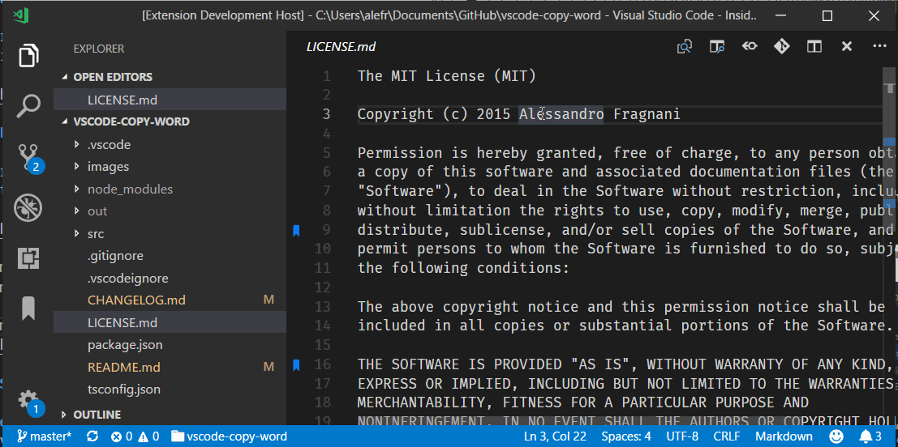
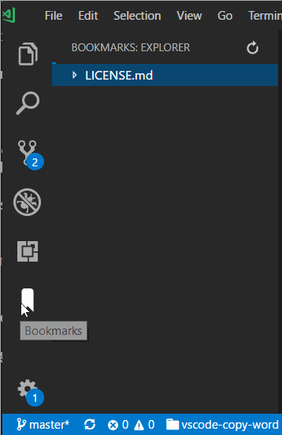

<p align="center">
  <br />
  <a title="Learn more about Bookmarks" href="http://github.com/alefragnani/vscode-bookmarks"></a>
</p>

# What's new in Bookmarks 9

* Moves the Treeview to its own **Activity Bar**
* Adds **column position** for bookmarks
* Adds **Labeled Bookmarks** with a new command `Toggle Labeled`
* Supports for **theme file icon** in Treeview
* Trim leading whitespaces in bookmarks list

# Bookmarks

**Bookmarks** is an open source extension created for **Visual Studio Code**. While being free and open source, if you find it useful, please consider [supporting it](#support-bookmarks).

It helps you to navigate in your code, moving between important positions easily and quickly. _No more need to search for code._ It also supports a set of **selection** commands, which allows you to select bookmarked lines and regions between bookmarked lines. It's really usefull for log file analyses.

Since version 9 you can also define **Labels** for you bookmarks!

Here are some of the features that **Bookmarks** provides:

* **Mark/unmark positions** in your code
* Mark positions in your code and **give it name**
* **Jump** forward and backward between bookmarks
* Icons in **gutter** and **overview ruler**
* See a list of all Bookmarks in one **file**
* See a list of all Bookmarks in your **project**
* A dedicated **Activity Bar**
* **Select lines** with bookmarks
* **Select regions** between bookmarks

# Features

## Available commands

* `Bookmarks: Toggle` Mark/unmark positions with bookmarks
* `Bookmarks: Toggle Labeled` Mark labeled bookmarks
* `Bookmarks: Jump to Next` Move the cursor forward, to the bookmark below
* `Bookmarks: Jump to Previous` Move the cursor backward, to the bookmark above
* `Bookmarks: List` List all bookmarks in the current file
* `Bookmarks: List from All Files` List all bookmarks from all files
* `Bookmarks: Clear` remove all bookmarks in the current file
* `Bookmarks: Clear from All Files` remove all bookmarks from all files
* `Bookmarks (Selection): Select Lines` Select all lines that contains bookmarks
* `Bookmarks (Selection): Expand Selection to Next` Expand the selected text to the next bookmark
* `Bookmarks (Selection): Expand Selection to Previous` Expand the selected text to the previous bookmark
* `Bookmarks (Selection): Shrink Selection` Shrink the select text to the Previous/Next bookmark

## Manage your bookmarks

### Toggle

You can easily Mark/Unmark bookmarks on any position.


### Toggle Labeled

You can even mark _labeled_ bookmarks on any position.



## Navigation

### Jump to Next / Previous

Quicky move between bookmarks backward and forward, even if located outside the active file.

### List / List from All Files

List all bookmarks from the current file/project and easily navigate to any of them. It shows a line preview and temporarily scroll to its position.


* Bookmarks from the active file only shows the line number and its contents
* Bookmarks from other files in the project also shows the relative path and filename
* Bookmarks from files outside the project are denoted with 

## Selection

You can use **Bookmarks** to easily select lines or text blocks. Simply toggle bookmarks in any position of interest and use some of the _Selection_ commands available.

#### Select Lines

Select all bookmarked lines. Specially useful while working with log files.


#### Expand Selection to the Next/Previous Bookmark or Shrink the Selection

Manipulate the selection of lines _between_ bookmarks, up and down.


## Available Settings

* Allow navigation through all files that contains bookmarks (`false` by default)
```
    "bookmarks.navigateThroughAllFiles": true
```

* Bookmarks are always saved between sessions, and you can decide if it should be saved _in the Project_, so you can add it to your Git/SVN repo and have it in all your machines _(`false` by default)_
```
    "bookmarks.saveBookmarksInProject": true
```

* Path to another image to be shown as Bookmark (16x16 px)
```
    "bookmarks.gutterIconPath": "c:\\temp\\othericon.png"
```

## Activity Bar

The **Bookmarks** are now presented in its own Activity Bar, giving you more free space in your Explorer bar. You will have a few extra commands available:

* Jump to a bookmark, simply clicking in the bookmark item
* Remove a bookmark, right clicking in the bookmark item
* Clear the bookmark's file, right-clickin in the file item



## Support Bookmarks

While **Bookmarks** is free and open source, if you find it useful, please consider supporting it.

I've been building **Bookmarks** since VS Code internal beta days, and while I enjoy developing it, I would like to be able to give more attention to its growth.

<table align="center" width="30%" border="0">
  <tr>
    <td>
      <a title="Paypal" href="https://www.paypal.com/cgi-bin/webscr?cmd=_donations&business=EP57F3B6FXKTU&lc=US&item_name=Alessandro%20Fragnani&item_number=vscode%20extensions&currency_code=USD&bn=PP%2dDonationsBF%3abtn_donate_SM%2egif%3aNonHosted"></a>
    </td>
    <td>
      <a title="Paypal" href="https://www.paypal.com/cgi-bin/webscr?cmd=_donations&business=EP57F3B6FXKTU&lc=BR&item_name=Alessandro%20Fragnani&item_number=vscode%20extensions&currency_code=BRL&bn=PP%2dDonationsBF%3abtn_donate_SM%2egif%3aNonHosted"></a>
    </td>
  </tr>
</table>

# License

[MIT](LICENSE.md) &copy; Alessandro Fragnani