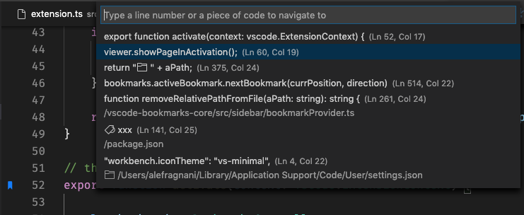
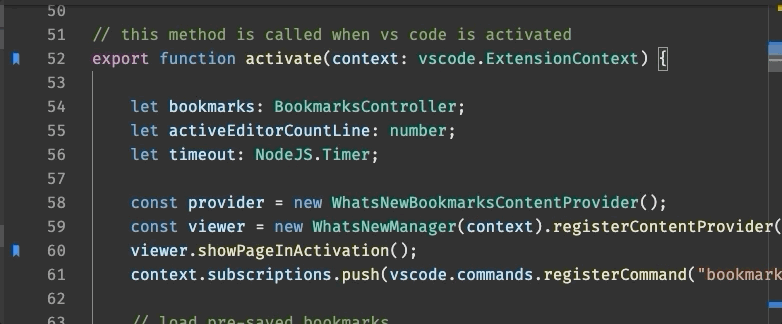

<p align="center">
  <br />
  <a title="Learn more about Bookmarks" href="http://github.com/alefragnani/vscode-bookmarks"></a>
</p>

# What's new in Bookmarks 12.1

* Improved **Side Bar** usability
* Adds automatic **Label suggestion** options
* Full **Multi cursor** support
* Support for **workbench.colorCustomizations** settings
* Improved **Localization** options

## Support

**Bookmarks** is an extension created for **Visual Studio Code**. If you find it useful, please consider supporting it.

<table align="center" width="60%" border="0">
  <tr>
    <td>
      <a title="Paypal" href="https://www.paypal.com/cgi-bin/webscr?cmd=_donations&business=EP57F3B6FXKTU&lc=US&item_name=Alessandro%20Fragnani&item_number=vscode%20extensions&currency_code=USD&bn=PP%2dDonationsBF%3abtn_donate_SM%2egif%3aNonHosted"></a>
    </td>
    <td>
      <a title="Paypal" href="https://www.paypal.com/cgi-bin/webscr?cmd=_donations&business=EP57F3B6FXKTU&lc=BR&item_name=Alessandro%20Fragnani&item_number=vscode%20extensions&currency_code=BRL&bn=PP%2dDonationsBF%3abtn_donate_SM%2egif%3aNonHosted"></a>
    </td>
    <td>
      <a title="Patreon" href="https://www.patreon.com/alefragnani"></a>
    </td>
  </tr>
</table>

## Sponsors

<a title="Learn more about CodeStream" href="https://sponsorlink.codestream.com/?utm_source=vscmarket&utm_campaign=bookmarks&utm_medium=banner"></a></br>
Eliminate context switching and costly distractions. Create and merge PRs and perform code reviews from inside your IDE while using jump-to-definition, your keybindings, and other IDE favorites.<br> <a title="Learn more about CodeStream" href="https://sponsorlink.codestream.com/?utm_source=vscmarket&utm_campaign=bookmarks&utm_medium=banner">Learn more</a>

<br>

# Bookmarks

It helps you to navigate in your code, moving between important positions easily and quickly. _No more need to search for code._ It also supports a set of **selection** commands, which allows you to select bookmarked lines and regions between bookmarked lines. It's really useful for log file analysis.

Here are some of the features that **Bookmarks** provides:

* **Mark/unmark positions** in your code
* Mark positions in your code and **give it name**
* **Jump** forward and backward between bookmarks
* Icons in **gutter** and **overview ruler**
* See a list of all Bookmarks in one **file** and **project**
* **Select lines** and **regions** with bookmarks
* A dedicated **Side Bar**

# Features

## Available commands

* `Bookmarks: Toggle` Mark/unmark positions with bookmarks
* `Bookmarks: Toggle Labeled` Mark labeled bookmarks
* `Bookmarks: Jump to Next` Move the cursor forward, to the bookmark below
* `Bookmarks: Jump to Previous` Move the cursor backward, to the bookmark above
* `Bookmarks: List` List all bookmarks in the current file
* `Bookmarks: List from All Files` List all bookmarks from all files
* `Bookmarks: Clear` remove all bookmarks in the current file
* `Bookmarks: Clear from All Files` remove all bookmarks from all files
* `Bookmarks (Selection): Select Lines` Select all lines that contains bookmarks
* `Bookmarks (Selection): Expand Selection to Next` Expand the selected text to the next bookmark
* `Bookmarks (Selection): Expand Selection to Previous` Expand the selected text to the previous bookmark
* `Bookmarks (Selection): Shrink Selection` Shrink the select text to the Previous/Next bookmark

## Manage your bookmarks

### Toggle / Toggle Labeled

You can easily Mark/Unmark bookmarks on any position. You can even define **Labels** for each bookmark.


## Navigation

### Jump to Next / Previous

Quicky move between bookmarks backward and forward, even if located outside the active file.

### List / List from All Files

List all bookmarks from the current file/project and easily navigate to any of them. It shows a line preview and temporarily scroll to its position.



* Bookmarks from the active file only shows the line number and its contents
* Bookmarks from other files in the project also shows the relative path and filename
* Bookmarks from files outside the project are denoted with 

## Selection

You can use **Bookmarks** to easily select lines or text blocks. Simply toggle bookmarks in any position of interest and use some of the _Selection_ commands available.

#### Select Lines

Select all bookmarked lines. Specially useful while working with log files.



#### Expand Selection to the Next/Previous Bookmark or Shrink the Selection

Manipulate the selection of lines _between_ bookmarks, up and down.

## Available Settings

* Allow navigation through all files that contains bookmarks (`true` by default)
```json
    "bookmarks.navigateThroughAllFiles": false
```

* Allow navigation to wrap around at the first and last bookmarks in scope (current file or all files) (`true` by default)
```json
    "bookmarks.wrapNavigation": true
```

* Bookmarks are always saved between sessions, and you can decide if it should be saved _in the Project_, so you can add it to your Git/SVN repo and have it in all your machines _(`false` by default)_
```json
    "bookmarks.saveBookmarksInProject": true
```

* Path to another image to be shown as Bookmark (16x16 px)
```json
    "bookmarks.gutterIconPath": "c:\\temp\\othericon.png"
```

* Choose the background color to use on a bookmarked line

```json
    "bookmarks.backgroundLineColor"
```
> Deprecated in 10.7: Use `workbench.colorCustomizations` instead. More info in [Available Colors](#available-colors)

* Allow bookmarks commands, (Toggle, Jump to Next/Previous), to be displayed on the editor contex menu (`true` by default)
```json
    "bookmarks.showCommandsInContextMenu": true
```

* Use a **workaround** for formatters, like Prettier, which does not notify on document changes and messes Bookmark's _Sticky_ behavior _(`false` by default)_

```json
    "bookmarks.useWorkaroundForFormatters": true
```
> This workaround should be temporary, until a proper research and suggested APIs are available  

* Choose if the Side Bar should start expanded (`false` by default)
```json
    "bookmarks.sideBar.expanded": true
```

* Choose how multi cursor handles already bookmarked lines (`allLinesAtOnce` by default)

  * `allLinesAtOnce`: Creates bookmarks in all selected lines at once, if at least one of the lines don't have a bookmark
  * `eachLineIndependently`: Literally toggles a bookmark in each line, instead of making all lines equals

```json
    "bookmarks.multicursor.toggleMode": "eachLineIndependently"
```

* Choose how labels are suggested when creating bookmarks (`dontUse` by default)

  * `dontUse`: Don't use the selection (original behavior)
  * `useWhenSelected`: Use the selected text _(if available)_ directly, no confirmation required
  * `suggestWhenSelected`: Suggests the selected text _(if available)_. You still need to confirm.
  * `suggestWhenSelectedOrLineWhenNoSelected`: Suggests the selected text _(if available)_ or the entire line (when has no selection). You still need to confirm

```json
    "bookmarks.label.suggestion": "useWhenSelected"
```

## Available Colors

* Choose the background color to use on a bookmarked line
```json
    "workbench.colorCustomizations": {
      "bookmarks.lineBackground": "#157EFB22"  
    }
```

* Choose the border color to use on a bookmarked line
```json
    "workbench.colorCustomizations": {
      "bookmarks.lineBorder": "#FF0000"  
    }
```

* Choose marker color to use in the overview ruler
```json
    "workbench.colorCustomizations": {
      "bookmarks.overviewRuler": "#157EFB88"  
    }
```

## Side Bar

The **Bookmarks** extension has its own **Side Bar**, with a variety of commands to improve you productivity. 


## Project and Session Based

The bookmarks are saved _per session_ for the project that you are using. You don't have to worry about closing files in _Working Files_. When you reopen the file, the bookmarks are restored.

It also works even if you only _preview_ a file (simple click in TreeView). You can put bookmarks in any file and when you preview it again, the bookmarks will be there.

# License

[MIT](LICENSE.md) &copy; Alessandro Fragnani