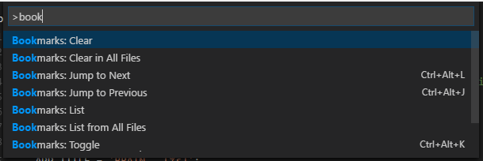
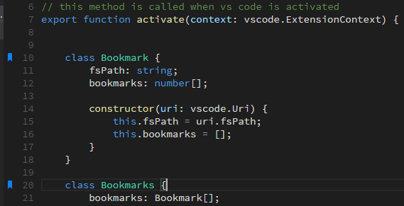
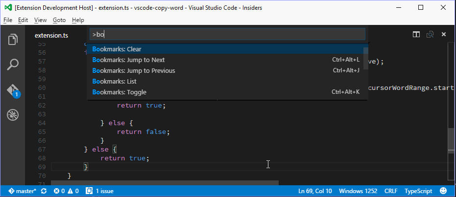
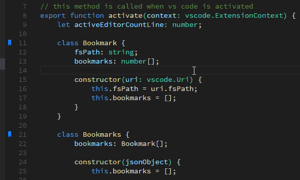

# Functionality

Mark lines in the editor and easily jump to them.

# Installation

Press `F1` in VSCode, type `ext install` and then look for `Bookmarks`.

# Usage

## Available commands

* **Bookmarks: Toggle** Mark/unmark lines with bookmarks
* **Bookmarks: Jump to Next** Move the cursor forward, to the bookmark below
* **Bookmarks: Jump to Previous** Move the cursor backward, to the bookmark above
* **Bookmarks: List** List all bookmarks from the current file
* **Bookmarks: List from All Files** List all bookmarks from all files
* **Bookmarks: Clear** remove all bookmarks from the current file
* **Bookmarks: Clear from All Files** remove all bookmarks from all files



### Bookmark: Toggle

You can easily Mark/Unmark bookmarks on any line. Works even for wrapped lines.



> _new in version 0.4.0_  

### Bookmarks: List

List all bookmarks from the current file and easily navigate to any one. It shows you the line contents and temporarily scroll to that line.



> _new in version 0.8.0_  

### Bookmarks: List from All Files

List all bookmarks from all files and easily navigate to any one. It shows you the line contents and temporarily scroll to that line.


* Bookmarks from the active file only shows the line number and its contents
* Bookmarks from other files in the project also shows the relative path and filename
* Bookmarks from files outside the project are denoted with 


## Available settings

> _new in version 0.7.0_  

* The bookmarks will be glued to the line of code _(context)_ instead of the line of the file
```
    "bookmarks.useStickyBookmarks": true
```



> _new in version 0.6.0_  

* Allow navigation through all files that contains bookmarks
```
    "bookmarks.navigateThroughAllFiles": true
```

* Allow bookmarks to be saved and restored, even if you close or change the Project
```
    "bookmarks.saveBookmarksBetweenSessions": true
```

* Path to another image to be shown as Bookmark (16x16 px)
```
    "bookmarks.gutterIconPath": "c:\\temp\\othericon.png"
```

## Project and Session Based

The bookmarks are saved _per session_ for the project that you are using. You don't have to worry about closing files in _Working Files_. When you reopen the file, the bookmarks are restored.

It also works even if you only _preview_ a file (simple click in TreeView). You can put bookmarks in any file and when you preview it again, the bookmarks will be there.

# Changelog

## Version 0.9.1

* **Fix:** Bookmarks missing on C/C++ files (PR [#32](https://github.com/alefragnani/vscode-bookmarks/pull/32) - kudos to @tlemo)

## Version 0.9.0

* **New:** Commands added to Context Menus (Editor and Title) (issue [#16](https://github.com/alefragnani/vscode-bookmarks/issues/16))

## Version 0.8.0

* **New Command:** List Bookmarks from all files
* **New Command:** Clear Bookmarks from all files

## Version 0.7.2

* **Fix:** Cannot jump to bookmark when scrolling with mouse (issue [#26](https://github.com/alefragnani/vscode-bookmarks/issues/26))

## Version 0.7.1

* **Fix:** Remove extension activation log (issue [#25](https://github.com/alefragnani/vscode-bookmarks/issues/25))

## Version 0.7.0

* **New Setting:** Sticky Bookmarks (kudos to @Terminux)

## Version 0.6.0

* **New:** Abitity to navigate to bookmarks in all files
* **New Setting:** Navigate through all files
* **Fix:** Error when there is no active file (issue [#18](https://github.com/alefragnani/vscode-bookmarks/issues/18))

## Version 0.5.0

* **New:** Bookmarks are also rendered in the overview ruler

## Version 0.4.0

* **New Command:** List all bookmarks from the current file

## Version 0.3.0

* License updated

## Version 0.2.0

* **New Setting:** Save bookmarks between sessions
* **New Setting:** Change the bookmark icon

## Version 0.1.1

* Initial release

# Participate

If you have any idea, feel free to create issues and pull requests

# License

[MIT](LICENSE.md) &copy; Alessandro Fragnani

---

[](https://www.paypal.com/cgi-bin/webscr?cmd=_donations&business=EP57F3B6FXKTU&lc=US&item_name=Alessandro%20Fragnani&item_number=vscode%20extensions&currency_code=USD&bn=PP%2dDonationsBF%3abtn_donate_SM%2egif%3aNonHosted) if you enjoy using this extension :-)