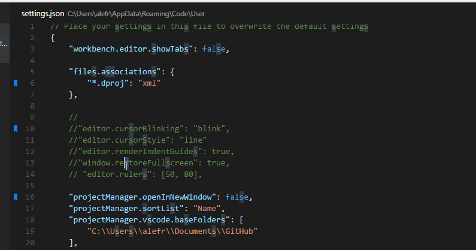
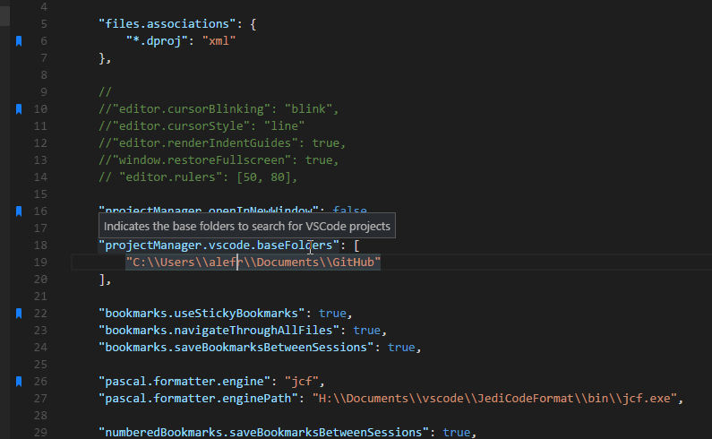
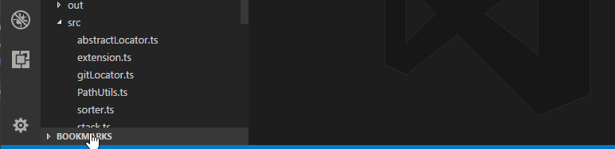

# Functionality

Mark lines in the editor and easily jump to them. 

Now you also can quickly select these lines or the text betweem them.

# Installation

Press `F1` in VSCode, type `ext install` and then look for `Bookmarks`.

# Usage

## Available commands

* **Bookmarks: Toggle** Mark/unmark lines with bookmarks
* **Bookmarks: Jump to Next** Move the cursor forward, to the bookmark below
* **Bookmarks: Jump to Previous** Move the cursor backward, to the bookmark above
* **Bookmarks: List** List all bookmarks in the current file
* **Bookmarks: List from All Files** List all bookmarks from all files
* **Bookmarks: Clear** remove all bookmarks in the current file
* **Bookmarks: Clear from All Files** remove all bookmarks from all files
* **Bookmarks (Selection): Select Lines** Select all lines that contains bookmarks
* **Bookmarks (Selection): Expand Selection to Next** Expand the selected text to the next bookmark
* **Bookmarks (Selection): Expand Selection to Previous** Expand the selected text to the previous bookmark
* **Bookmarks (Selection): Shrink Selection** Shrink the select text to the Previous/Next bookmark


### Bookmark: Toggle

You can easily Mark/Unmark bookmarks on any line. Works even for wrapped lines.


### Bookmarks: List

List all bookmarks from the current file and easily navigate to any one. It shows you the line contents and temporarily scroll to that line.


### Bookmarks: List from All Files

List all bookmarks from all files and easily navigate to any one. It shows you the line contents and temporarily scroll to that line.


* Bookmarks from the active file only shows the line number and its contents
* Bookmarks from other files in the project also shows the relative path and filename
* Bookmarks from files outside the project are denoted with 

### Bookmarks (Selection)

You can use **Bookmarks** to easily select lines or text blocks. Simply toggle bookmarks in any line of interest and use some of the _Selection_ commands available.

#### Bookmarks (Selection): Select Lines

Select all bookmarked lines. Specially useful while working with log files.



#### Bookmarks (Selection): Expand Selection to the Next/Previous Bookmark or Shrink the Selection

Manipulate the selection of lines _between_ bookmarks, up and down.



## Available settings

* Allow navigation through all files that contains bookmarks
```
    "bookmarks.navigateThroughAllFiles": true
```

* Bookmarks are always saved between sessions, and you can decide if it should be saved _in the Project_, so you can add it to your Git/SVN repo and have it in all your machines _(`false` by default)_
```
    "bookmarks.saveBookmarksInProject": true
```

> the `saveBookmarksBetweenSessions` setting was replaced by this this in version 0.13.0

* Path to another image to be shown as Bookmark (16x16 px)
```
    "bookmarks.gutterIconPath": "c:\\temp\\othericon.png"
```

## Treeview

> _Preview in version 0.16.0_

A first step on a **Bookmarks Treeview** was added in this release, and now you have a list of all your bookmarks, right in the Explorer panel. A few commands were added:
* Jump to a bookmark, simply clicking in the bookmark item
* Remove a bookmark, right clicking in the bookmark item
* Clear the bookmark's file, right-clickin in the file item



### Known issues

* Renaming/deleting a file does not update the file item
* Changing the content of a bookmarked line does not update the bookmark item 

> Use the `Refresh` button in the Treeview title

## Project and Session Based

The bookmarks are saved _per session_ for the project that you are using. You don't have to worry about closing files in _Working Files_. When you reopen the file, the bookmarks are restored.

It also works even if you only _preview_ a file (simple click in TreeView). You can put bookmarks in any file and when you preview it again, the bookmarks will be there.

# Participate

If you have any idea, feel free to create issues and pull requests

# License

[MIT](LICENSE.md) &copy; Alessandro Fragnani

---

[](https://www.paypal.com/cgi-bin/webscr?cmd=_donations&business=EP57F3B6FXKTU&lc=US&item_name=Alessandro%20Fragnani&item_number=vscode%20extensions&currency_code=USD&bn=PP%2dDonationsBF%3abtn_donate_SM%2egif%3aNonHosted) a :coffee: if you enjoy using this extension :wink: