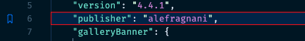

## Görünüşü Fərdiləşdirmə

Yalnız ikonun Kənar Zolaqda necə göstərildiyini deyil, həm də əlfəcinlənmiş sətrə fon rəngi və ümumi baxış zolağına rəng əlavə etməyi də fərdiləşdirə bilərsiniz.

Parametrlərinizdə buna bənzər bir şey:

```json
    "bookmarks.gutterIconFillColor": "none",
    // "bookmarks.gutterIconBorderColor": "157EFB",
    "workbench.colorCustomizations": {
      ...
      "bookmarks.lineBackground": "#0077ff2a",
      "bookmarks.lineBorder": "#FF0000", 
      "bookmarks.overviewRuler": "#157EFB88"  
    }
```

Nəticədə belə bir əlfəcin əldə edə bilərsiniz:

