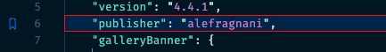

## Erscheinungsbild anpassen

Sie können nicht nur steuern, wie das Symbol im Gitter angezeigt wird, sondern auch eine Hintergrundfarbe für die markierte Zeile und den Übersichtsruler hinzufügen.

So könnte das in Ihren Einstellungen aussehen:

```json
    "bookmarks.gutterIconFillColor": "none",
    // "bookmarks.gutterIconBorderColor": "157EFB",
    "workbench.colorCustomizations": {
      ...
      "bookmarks.lineBackground": "#0077ff2a",
      "bookmarks.lineBorder": "#FF0000", 
      "bookmarks.overviewRuler": "#157EFB88"  
    }
```

Das Ergebnis könnte dann so aussehen:

