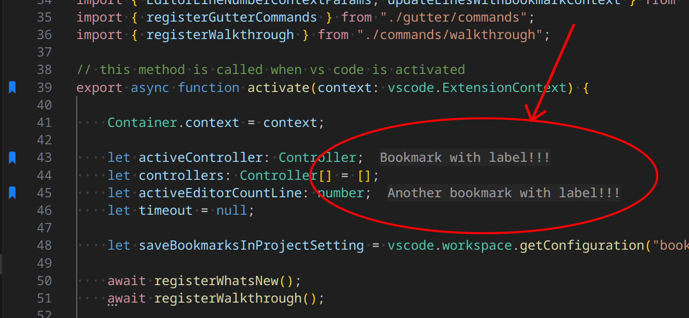

## Define Labels for Your Bookmarks

Bookmarks represent positions in your code, so you can easily and quickly go back to them whenever necessary. But sometimes its position or the content of that line is not so meaningful as you would like to be. 

To fill this gap, you can define **Labels** to be tied to the bookmark. 

You can eaily type your own **Label** when you toggle a bookmark, or you can ask the extension to suggest for you.

You have a handlfull of alternatives to choose:

  * `useWhenSelected`: Use the selected text _(if available)_ directly, no confirmation required
  * `suggestWhenSelected`: Suggests the selected text _(if available)_. You still need to confirm.
  * `suggestWhenSelectedOrLineWhenNoSelected`: Suggests the selected text _(if available)_ or the entire line (when has no selection). You still need to confirm

<table align="center" width="85%" border="0">
  <tr>
    <td align="center">
      <a title="Open Settings" href="command:workbench.action.openSettings?%5B%22bookmarks.label.suggestion%22%5D">Open Settings</a>
    </td>
  </tr>
</table>

## Label text is displayed inline

By default bookmark label text appears next to the line where labeled bookmark is placed. By default it looks just like inlay hint. You can customize this text appearance (or turn it off) by the following settings:

  * `bookmarks.enableLabelInlineMessage`: Enable showing bookmark label text next to actual line with labeled bookmark _(`true` by default)_
  * `bookmarks.labelInlineMessageMargin`: Margin between end of the line and bookmark label inline text. Makes sense only if bookmarks.enableLabelInlineMessage setting enabled _(`2` by default)_
  * `bookmarks.labelInlineMessageItalic`: Make bookmark label inline text italic. Makes sense only if bookmarks.enableLabelInlineMessage setting enabled _(`false` by default)_
  * `bookmarks.labelInlineMessageTextColor`: Text color for bookmark label inline text. If not specified same color as for inlay hints is used. Makes sense only if bookmarks.enableLabelInlineMessage setting enabled
  * `bookmarks.labelInlineMessageBackgroundColor`: Background color for bookmark label inline text. If not specified same color as for inlay hints is used. Makes sense only if bookmarks.enableLabelInlineMessage setting enabled
  * `bookmarks.labelInlineMessageFontWeight`: Font thickness for bookmark label inline text. Makes sense only if bookmarks.enableLabelInlineMessage setting enabled _(`450` by default)_
