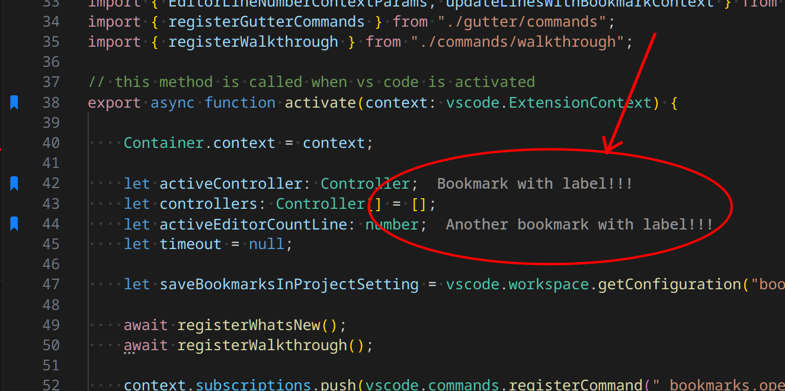

## Elegir etiquetas para tus marcadores

Los marcadores establecen posiciones concretas en tu código para que puedas volver a esas posiciones rápida y fácilmente siempre que quieras. Sin embargo, puede que la posición o el contenido de la línea no sean tan útiles como te gustaría que fuesen.

Para solucionar esto, puedes escribir **etiquetas**, que van unidas al marcador.

Puedes escribir tu propia **etiqueta** cuando estableces un marcador; también puedes dejar que la extensión te sugiera una.

Tienes un montón de alternativas entre las que elegir:

  * `useWhenSelected`: usa el texto seleccionado inmediatamente _(si está disponible)_. No se necesita confirmación.
  * `suggestWhenSelected`: sugiere el texto seleccionado _(si está disponible)_. Es necesario que lo confirmes.
  * `suggestWhenSelectedOrLineWhenNoSelected`: sugiere el texto seleccionado _(si está disponible)_ o la línea entera (si no hay ninguna selección). Es necesario que lo confirmes.

<table align="center" width="85%" border="0">
  <tr>
    <td align="center">
      <a title="Abrir la configuración" href="command:workbench.action.openSettings?%5B%22bookmarks.label.suggestion%22%5D">Abrir la configuración</a>
    </td>
  </tr>
</table>

## El texto de la etiqueta se muestra en línea



Puedes activar la visibilidad del texto de las etiquetas en línea en la misma línea donde se coloca el marcador etiquetado habilitando `bookmarks.label.inline.enabled`.

El texto de la etiqueta de marcador aparece junto a la línea donde se coloca el marcador etiquetado. Por defecto, se ve como la decoración de texto de git blame. Puedes activar esta función y personalizar su apariencia mediante las siguientes configuraciones:

  * `bookmarks.label.inline.enabled`: Habilita mostrar el texto de la etiqueta junto a la línea real del marcador etiquetado _(`false` por defecto)_
  * `bookmarks.label.inline.margin`: Margen entre el final de la línea y el texto en línea de la etiqueta. Solo tiene sentido si la configuración bookmarks.label.inline.enabled está habilitada _(`2` por defecto)_
  * `bookmarks.label.inline.fontStyle`: Estilo de fuente del texto en línea de la etiqueta (p. ej. `"italic"`). Solo tiene sentido si la configuración bookmarks.label.inline.enabled está habilitada _(`"normal"` por defecto)_
  * `bookmarks.labelInlineMessageTextColor`: Color de texto para el texto en línea de la etiqueta. Si no se especifica, se utiliza el mismo color que para los inlay hints. Solo tiene sentido si la configuración bookmarks.label.inline.enabled está habilitada
  * `bookmarks.label.inline.fontWeight`: Grosor de fuente para el texto en línea de la etiqueta. Solo tiene sentido si la configuración bookmarks.label.inline.enabled está habilitada _(`450` por defecto)_
  * `bookmarks.labelInlineMessageBackgroundColor`: Color de fondo para el texto en línea de la etiqueta. Si no se especifica, se utiliza el mismo color que para los inlay hints. Solo tiene sentido si la configuración bookmarks.label.inline.enabled está habilitada

Para cambiar el color del texto/fondo del texto en línea de la etiqueta del marcador:
```json
    "workbench.colorCustomizations": {
      "bookmarks.labelInlineMessageTextColor": "#23ca11f3",
      "bookmarks.labelInlineMessageBackgroundColor": "#6161611a",
    }
```
