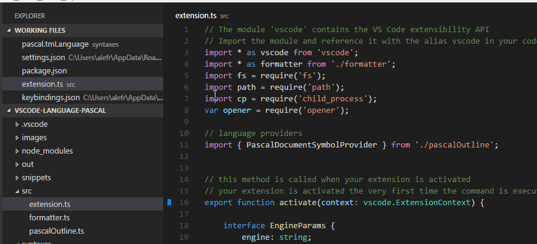

## Navigate to Bookmarks

Bookmarks represent positions in your code, so you can easily and quickly go back to them whenever necessary. 

The extension provides commands to quickly navigate back and forth between bookmarks, like `Bookmarks: Jump to Next` and `Bookmarks: Jump to Previous`.

But it is not limited to this. It also provides commands to see all Bookmarks within a file, or the entire workspace and easily go to it. Use the `Bookmarks: List` and `Bookmarks: List from All Files` command instead, and the extension will display a preview of the bookmarked line (or its label) and it position. 

> Tip: If you simply navigate on the list, the editor will temporarily scroll to its position, giving you a better understanding if that bookmark is what you were looking for.

