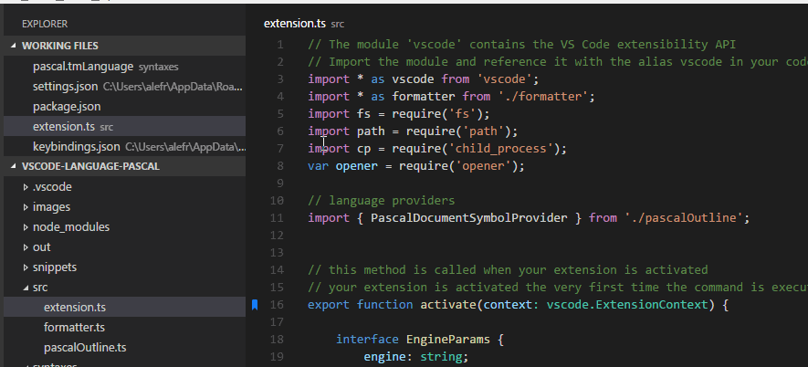

## Zu Lesezeichen navigieren

Lesezeichen repräsentieren Positionen in Ihrem Code, sodass Sie schnell und einfach dorthin zurückkehren können, wann immer es nötig ist. 

Die Erweiterung bietet Befehle, um schnell zwischen Lesezeichen vor- und zurückzuspringen, wie `Bookmarks: Jump to Next` und `Bookmarks: Jump to Previous`.

Das ist aber nicht alles. Sie bietet auch Befehle, um alle Lesezeichen in einer Datei oder im gesamten Arbeitsbereich anzuzeigen und direkt dorthin zu springen. Verwenden Sie den Befehl `Bookmarks: List` bzw. `Bookmarks: List from All Files`, und die Erweiterung zeigt eine Vorschau der markierten Zeile (oder ihres Labels) und ihrer Position an. 

> Tipp: Wenn Sie einfach in der Liste navigieren, scrollt der Editor vorübergehend zur entsprechenden Stelle, damit Sie besser einschätzen können, ob es das gesuchte Lesezeichen ist.

