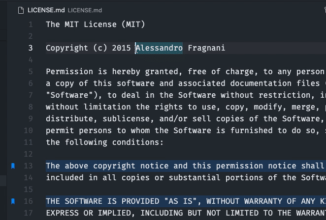

## 跳转至书签

书签承载了你代码中的位置信息，以便你可以随时方便快捷的跳转回去。

本扩展提供了能够在书签之间快速来回导航的命令： `书签: 跳转至上一个书签` 与 `书签: 跳转至下一个书签`。

但绝不仅限于此，本扩展还提供了这些指令：

- `书签: 列出文件中所有书签`：列出文件中的所有书签；
- `书签: 列出所有书签`：列出所有文件中的书签；

使用这些指令时，本扩展便会显示书签标记行（或是其标签）及其位置的预览。

> Tip: 你只需在列表中上下切换，编辑器就会自动暂时滚动到书签所在的位置，这样你就能更快的找到你所需要的书签了。
