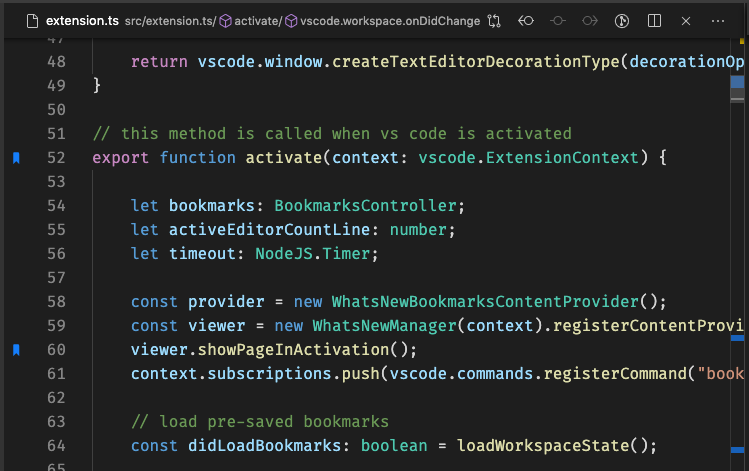

## Lesezeichen umschalten

Sie können Lesezeichen an jeder Position ganz einfach setzen oder entfernen. Sie können sogar **Labels** für jedes Lesezeichen festlegen.

> Tipp: Verwenden Sie die Tastenkombination <kbd>Cmd</kbd> + <kbd>Alt</kbd> + <kbd>K</kbd>